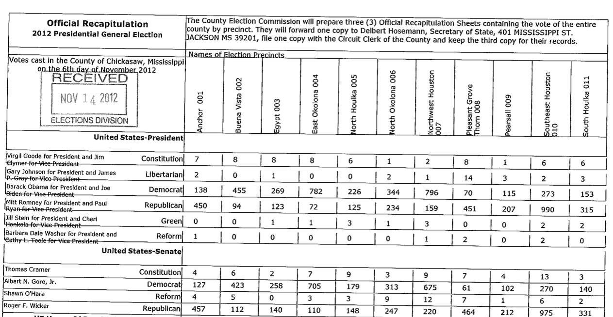
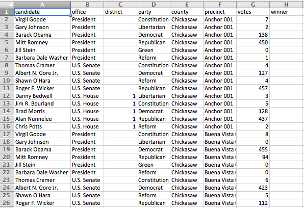
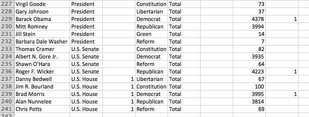
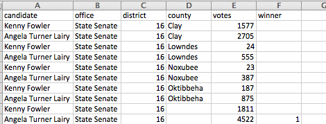

OpenElections Data Mississippi
=====================

Converted CSVs of Mississippi election results.

### The Process

TO BE CLEAR: This is data entry work. There is no magic here.

Mississippi stores election results in PDF files at [the Secretary of State's site](http://www.sos.ms.gov/elections4.aspx). The files are stored by year, and then either by race (for special elections) or by county (for primary and general elections). The county files contain precinct-level results, organized by office, with precincts labeled vertically across the top. Here's a file from the Nov. 6, 2012 general election in Chickasaw County:

File names match [the `generated_name` standard described in our docs](http://docs.openelections.net/archive-standardization/). So the CSV file to match the above example would be 20121106__ms__general__chickasaw__precinct.csv.

The OpenElections CSV layout approach is to mirror the results file as much as possible, with one exception: we try to have a single result on each line, rather than multiple candidates or precincts.

Where totals are included, leave the precinct column blank and mark the overall winner in each race in the `winner` column, which takes a boolean value:

For elections that have only county-level results, total rows will leave the county blank for races that involve more than one county:

For elections in which two candidates advance to a runoff, both candidates are marked as `winner`.

### Instructions

* We're only interested in federal, statewide and state legislative offices. No local offices.
* Don't include precincts which have "X" in the vote totals.
* Don't include "County" in the county name.
* Don't include "Precinct" in the name of the precinct.
* For precincts with numbers in the name, remove any leading zeros (005 becomes 5).
* Even within the same election, the order of candidates will differ between counties.

### How to Contribute

##### The Git Way

1. Fork this repository.
2. Pick an election and add it and your name to the [contributors file](contributors.csv).
3. Add CSV results files to your repository.
4. Submit a pull request when done.

##### The Non-Git Way

1. Pick an election.
2. Email openelections@gmail.com to let us know what you're working on.
3. Create CSV files.
4. Email openelections@gmail.com with the files attached or a link to the files.

### Questions

If you run into questions about the PDFs or how to enter the results, check out the [Issues](https://github.com/openelections/openelections-data-ms/issues) or file a new one.